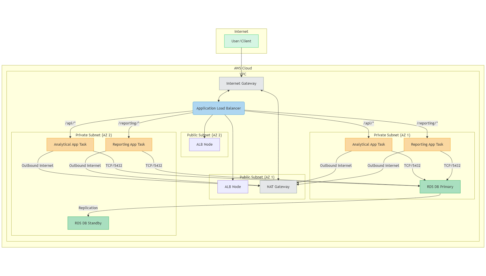

# **Serverless Analytical Web App with AWS CDK**

## **Overview**

This project demonstrates the deployment of a containerized Python Flask web application to **AWS Fargate** using the **AWS Cloud Development Kit (CDK)** for Infrastructure as Code (IaC). The application serves as a mock analytical tool, showcasing a modern DevOps approach to building, deploying, and managing cloud-native applications.

The primary goal is to showcase expertise in **cloud infrastructure implementation**, **DevOps practices**, **CI/CD** (to be implemented), **containerization**, and **serverless architectures** on AWS.

## **Features Demonstrated (So Far)**

- **Infrastructure as Code (IaC):** AWS CDK (Python) defines and provisions all AWS resources.
- **Containerization:** Python Flask app containerized using Docker.
- **AWS Fargate:** Serverless compute for containers hosting the app.
- **Application Load Balancer (ALB):** Distributes traffic to Fargate tasks.
- **Amazon ECR:** Stores Docker image via CDK’s `from_asset`.
- **Amazon VPC:** Custom VPC setup.
- **AWS IAM:** Roles and permissions via CDK.
- **Scalable Architecture:** Resilient and cloud-native design.

## **Architecture**

The Flask backend is containerized with Docker and deployed as a **Fargate service** within a **custom VPC**, fronted by an **ALB**. All infrastructure is managed by **AWS CDK**.

### **AWS Services Used**

- Amazon ECS (Fargate)
- Application Load Balancer (ALB)
- Amazon ECR
- Amazon VPC
- AWS IAM
- AWS CloudFormation (via CDK)
- Amazon CloudWatch

### **Diagram (Mermaid Syntax)**

---

## **Project Structure**

```
serverless-analytical-app/
├── .github/
│   └── workflows/
│       └── main.yml          # CI/CD deployment workflow
├── application/              # Source for the Analytical App
│   ├── app.py
│   └── requirements.txt
├── reporting_app/            # Source for the Reporting App
│   ├── app.py
│   ├── Dockerfile
│   └── requirements.txt
├── infrastructure/           # AWS CDK IaC code
│   ├── app.py
│   ├── infrastructure_stack.py # Defines all cloud resources
│   └── requirements.txt
├── Dockerfile                # Dockerfile for the Analytical App
└── README.md                 # This file

```

---

## **Prerequisites**

- Python (3.9+)
- Node.js (Latest LTS recommended)
- AWS CDK Toolkit (`npm install -g aws-cdk`)
- AWS CLI (configured)
- Docker
- Git

---

## **Setup and Local Development**

### **Clone Repository**

```bash
git clone <your-repository-url>
cd serverless-analytical-app
```

### **Create Virtual Environment**

```bash
python3 -m venv .venv
source .venv/bin/activate
```

### **Install Flask App Dependencies**

```bash
pip install -r application/requirements.txt
```

### **Run Flask Locally**

```bash
cd application
python app.py
```

> Access via: http://127.0.0.1:5000

---

### **Run Docker Locally**

```bash
cd .. # Project root
docker build -t stockland-app .
docker run -p 5001:8000 --rm stockland-app
```

> Access via: http://127.0.0.1:5001

---

## **Cloud Deployment with AWS CDK**

### **Activate Environment**

```bash
source .venv/bin/activate
```

### **Install CDK Dependencies**

```bash
cd infrastructure
pip install -r requirements.txt
```

### **Configure AWS**

```bash
aws configure
```

> Enter Access Key, Secret, Region (e.g., `us-east-1`), and output format.

---

### **CDK Bootstrap (One-Time)**

```bash
cdk bootstrap aws://ACCOUNT_ID/REGION
# Example:
cdk bootstrap aws://123456789012/us-east-1
```

---

### **Synthesize CloudFormation Template**

```bash
cdk synth
```

---

### **Deploy to AWS**

```bash
cdk deploy
```

> Approve IAM changes if prompted.

---

### **Access Deployed App**

After deployment, CDK outputs the ALB DNS:

```text
http://<your-load-balancer-dns>
```

---

### **Tear Down Infrastructure**

```bash
cdk destroy
```

---

## **Key Files**

- `Dockerfile`: Flask image build and Gunicorn runner.
- `application/app.py`: Main Flask app with endpoints, defining API endpoints and serving mock analytical data.
- `infrastructure/infrastructure_stack.py`: CDK-defined AWS infra.
- `infrastructure/app.py`: CDK app entry point.
- `infrastructure/cdk.json`: CDK execution config.

---

## **Future Enhancements**

### **Phase 5: Add PostgreSQL Database**

- Integrate AWS RDS PostgreSQL.
- Connect Flask to RDS.

### **Phase 6: Implement CI/CD Pipeline**

- Automate test, build, and deploy with GitHub Actions.
### ⚙️ CI/CD Pipeline (GitHub Actions)
🔁 Trigger
Automatically runs on push to main branch.

### 🔐 Authentication
- Uses OIDC to assume IAM role.
- No AWS secrets stored in GitHub.

## 📋 Steps
Checkout repository
Setup Node.js and Python
Authenticate to AWS via OIDC
Install dependencies
Build and deploy using cdk synth + cdk deploy

### 🛡️ Setup for CI/CD
1. Create OIDC Provider in AWS IAM
URL: https://token.actions.githubusercontent.com

Audience: sts.amazonaws.com

2. Create IAM Role for GitHub Actions
Trusts the OIDC provider

# Permissions:

- sts:AssumeRole
- iam:PassRole
- Admin or least-privileged access for CDK resources

### 3. GitHub Repository Secrets
# Add the following secrets:

- AWS_ACCOUNT_ID
- AWS_REGION
- AWS_OIDC_ROLE_NAME

# 🔑 Key Files
- `.github/workflows/main.yml` — GitHub Actions pipeline
- `Dockerfile` — Flask Docker build
- `application/app.py` — Flask backend logic
- `infrastructure/infrastructure_stack.py` — CDK stack logic

### Serverless Multi-Service Web App with AWS CDK
Project Story: In-Depth — Building and Deploying a Cloud-Native Multi-Service Application
Interviewer: "Can you tell me about a project you're proud of, perhaps one that highlights your DevOps skills and problem-solving abilities?"

Certainly. I recently evolved a personal project to demonstrate a more complex, real-world architecture. I started by building a Serverless Analytical Web App and then extended it into a multi-service system. The project now features two independent applications sharing core infrastructure, all defined with Infrastructure as Code and deployed via a fully automated CI/CD pipeline. It was an excellent exercise in managing a more complex cloud environment.

The Vision: From Monolith to Microservices
My initial vision was a single, automated application deployment. This quickly evolved into a more challenging goal:

How could I add a second, distinct application that shared some resources (like the database) without creating a tightly coupled system?

This led me to refactor the architecture to support a multi-service pattern using a shared Application Load Balancer (ALB).

The Journey & Key Decisions (Phase by Phase)
Phase 1–4: Building the Foundation (The First Application)
Built the foundational Analytical App — a Python Flask API containerized with Docker.

Used AWS CDK (Python) to define infrastructure:

Custom VPC

ECS Fargate service

Application Load Balancer

RDS PostgreSQL database

AWS Secrets Manager for secure credential handling

Key Challenges:
Dependency Management: Separating application and CDK dependencies cleanly.

Docker Build Issues: Fixed exec format error by setting Docker build platform to linux/amd64.

CloudFormation Stability: Debugged deployment issues like local clock skew and stack rollback errors.

Phase 5: Evolving to a Multi-Service Architecture
Goal: Deploy a second, independent Reporting App sharing the same VPC, RDS, and ALB.

Steps & Decisions:
New App Directory: Created reporting_app/ with:

Separate Flask app

Independent requirements.txt and Dockerfile

Refactoring the CDK Stack:

Replaced ecs_patterns.ApplicationLoadBalancedFargateService with manual constructs:

Defined shared elbv2.ApplicationLoadBalancer

Added single listener on port 80 with a default_action returning 404 Not Found

Created two ecs.FargateService constructs — one for each app

Path-Based Routing:
Analytical App (Priority 1):
conditions=[elbv2.ListenerCondition.path_patterns(["/api/*", "/"])]

Reporting App (Priority 2):
conditions=[elbv2.ListenerCondition.path_patterns(["/reporting", "/reporting/*"])]

Shared Resource Access:

Both Fargate services used same Secrets Manager secret

Security groups allowed DB connectivity from both services

Challenges Faced:
CDK TypeError:
Caused by incorrect argument usage. Resolved by properly using elbv2.ListenerCondition.path_patterns().

Listener Validation Error:
Fixed by defining a default_action on the listener.

Health Check Failures:
Resolved by setting health_check.path = "/reporting" for the Reporting App.

404 on Base Path:
/reporting/* missed /reporting. Fixed by updating rule to ["/reporting", "/reporting/*"].

Phase 6: CI/CD Pipeline Implementation
Goal: Automate deployment with GitHub Actions

Implementation:
Used OIDC for secure, keyless GitHub-to-AWS authentication

On push to main:

Pipeline synthesizes CDK code

Builds two Docker images

Deploys all infrastructure and services

Challenges:
IAM/OIDC Setup:
Required correct trust relationships and IAM role permissions for GitHub Actions to manage AWS resources.

The Final Outcome
Two independent applications deployed as Fargate services

Shared ALB and RDS instance

Infrastructure-as-Code with AWS CDK

Automated CI/CD pipeline via GitHub Actions

Result: A robust, scalable, cost-effective multi-service architecture aligned with modern microservices best practices.

Learnings & Connection to the Role
This project showcased my ability to:

Design & Implement Complex Cloud Infrastructure:
Evolved from monolithic to microservices with shared architecture.

Troubleshoot Systematically:
Solved issues in networking (ALB), infrastructure (CDK), and app config (health checks).

Apply Best Practices:
Used default ALB actions, specific health checks, and secure resource sharing.

Automate Everything:
Enabled reliable, hands-off deployments with a fully automated pipeline.

Future Enhancements
Advanced CI/CD: Implement PR validation workflows with linting, unit tests, and security scanning.

Observability: Create service-specific CloudWatch Dashboards and alarms.

Security Hardening: Refine IAM permissions to strict least privilege and integrate AWS WAF.

Database Migrations: Integrate a tool like Alembic to manage schema changes in an automated fashion, which becomes critical in a multi-service, shared-database environment.

Could not assume role with OIDC: Not authorized to perform sts:AssumeRoleWithWebIdentity

